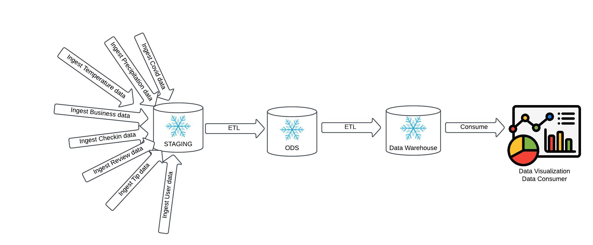
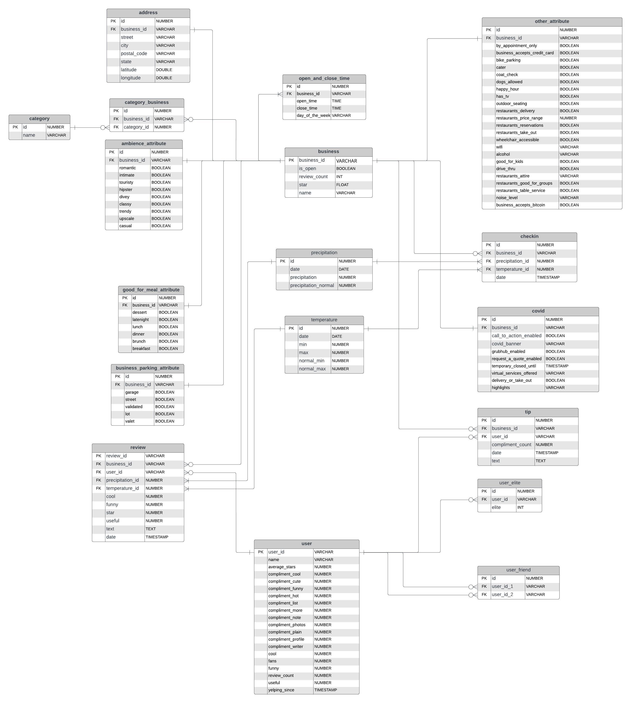

# Design a Data Warehouse for Reporting and OLAP

This project focuses on designing a data warehouse for reporting and online analytical processing (OLAP) purposes. By merging two real-world datasets, we will analyze how weather conditions affect Yelp reviews.

## Project Overview

In this project, we will follow a step-by-step process to design a data warehouse that enables efficient reporting and OLAP analysis. We will merge two datasets: the Yelp dataset and the weather dataset. By combining these datasets, we can draw meaningful conclusions about the impact of weather on Yelp reviews.

## Project Steps

1. **Downloading the Data**: We will start by obtaining the necessary datasets for the project. Make sure you have around 10 GB of free disk space. You can download the Yelp dataset from the [Yelp Dataset](https://www.yelp.com/dataset/download) page by entering your details and clicking "Download." Additionally, you will need to download the "COVID-19 Data" file from the same page.

2. **Data Exploration**: Once we have the datasets, we will explore them to gain a better understanding of their structure and contents. This step will help us identify the relevant fields and tables for our data warehouse design.

3. **Data Modeling**: Next, we will design the data model for our data warehouse. We will define the dimensions, facts, and relationships between tables to support efficient reporting and OLAP analysis. We will use a star schema or snowflake schema depending on the requirements.

4. **Data Loading**: After designing the data model, we will load the data into our data warehouse. We will use appropriate ETL (Extract, Transform, Load) processes to transform and load the data from the source datasets into the target tables of our data warehouse.

5. **Data Validation**: Once the data is loaded, we will perform data validation to ensure the accuracy and integrity of the data. We will run queries and checks to verify that the data is correctly loaded and conforms to the defined data model.

6. **OLAP Analysis**: Finally, we will leverage the power of OLAP to analyze the data and draw insights. We will use OLAP queries and tools to perform aggregations, drill-downs, and slice-and-dice operations on the data to answer specific business questions related to the impact of weather on Yelp reviews.

## Project Artifacts

#### Data Architect Diagram

#### ODS Entity Diagram

#### Data Warehouse Star Schema
